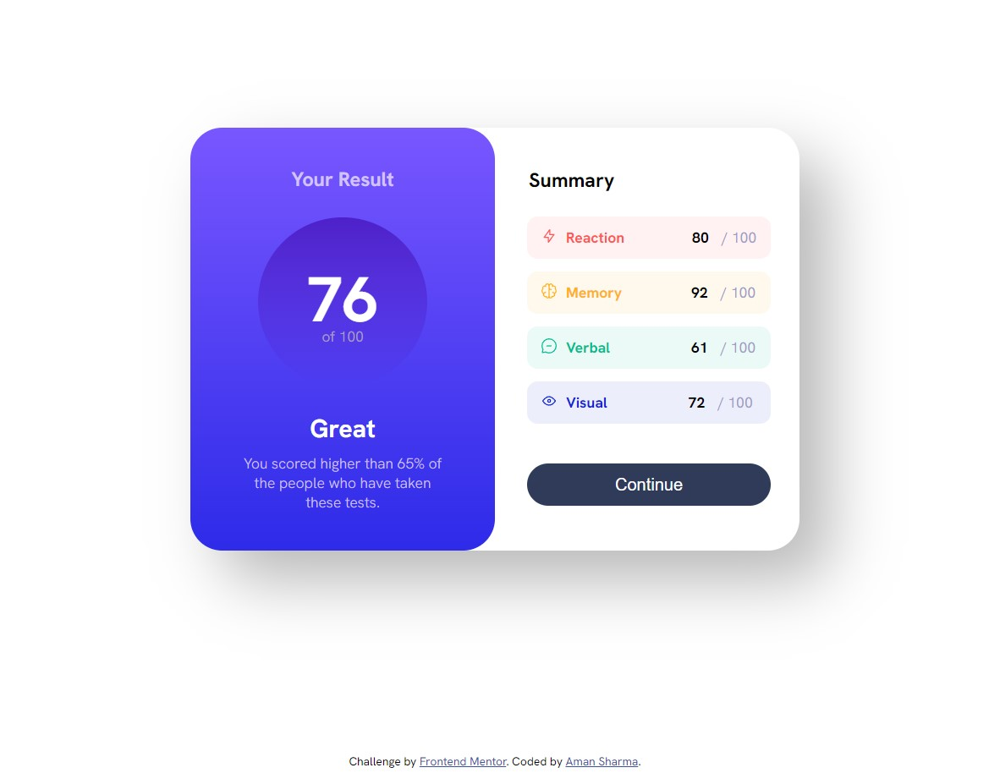

# Frontend Mentor - Results summary component solution

This is a solution to the [Results summary component challenge on Frontend Mentor](https://www.frontendmentor.io/challenges/results-summary-component-CE_K6s0maV). Frontend Mentor challenges help you improve your coding skills by building realistic projects. 

## Table of contents

- [Overview](#overview)
  - [The challenge](#the-challenge)
  - [Screenshot](#screenshot)
  - [Links](#links)
- [My process](#my-process)
  - [Built with](#built-with)
- [Author](#author)

## Overview

### The challenge

Users should be able to:

- View the optimal layout for the interface depending on their device's screen size
- See hover and focus states for all interactive elements on the page
- **Bonus**: Use the local JSON data to dynamically populate the content

### Screenshot

### Links

- Solution URL: [https://github.com/amansharma234/Result_Summary_Component]

## My process
Started off with centering DIV and creating the base div and seperate them in 2 parts left and right card and structured as per the design.
Fun Fact🫡: => I created lots divs and played with flexbox process of designing html elements and used custom CSS only.
 
### Built with

- Semantic HTML5 markup
- CSS custom properties
- Flexbox

## Author

- Frontend Mentor - [@amansharma234](https://www.frontendmentor.io/profile/amansharma234)
- Github - [@amansharma234](https://github.com/amansharma234)

